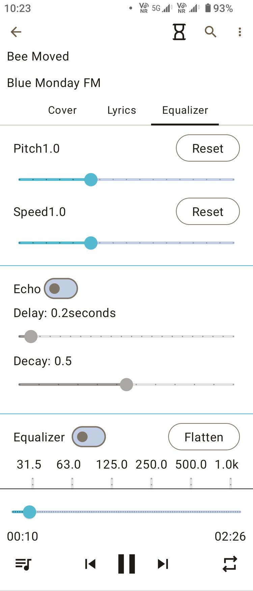
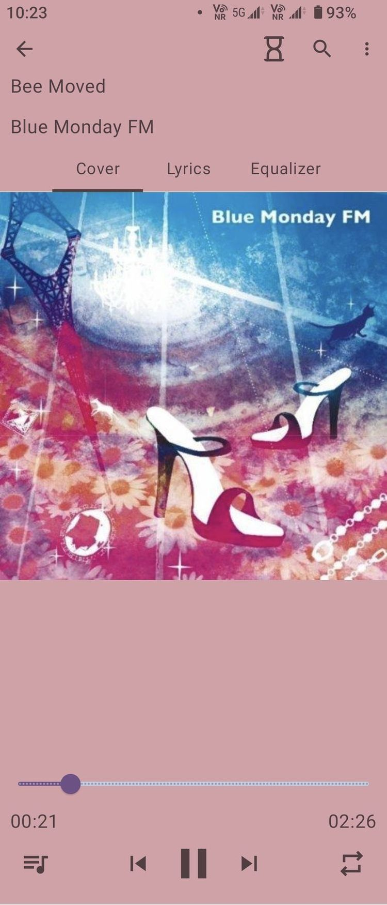
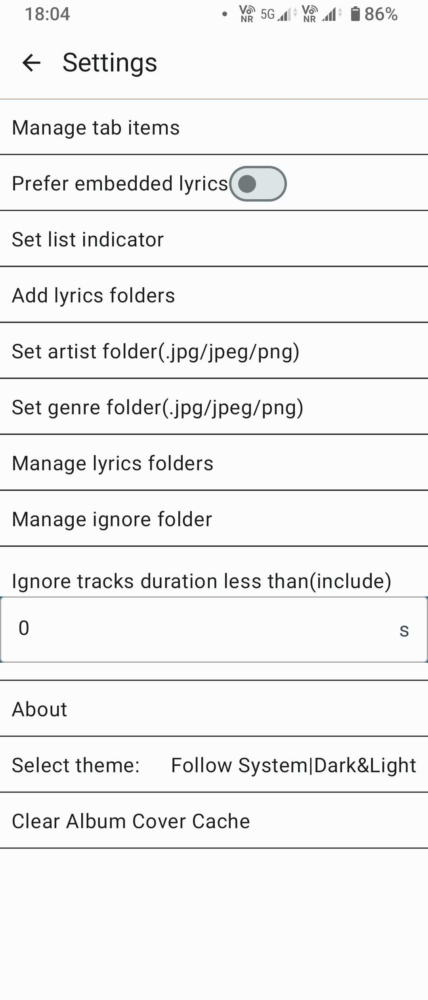
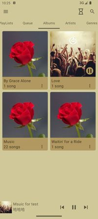
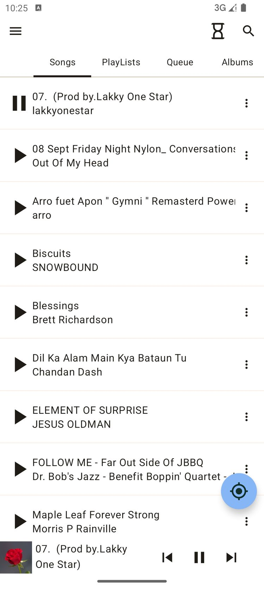
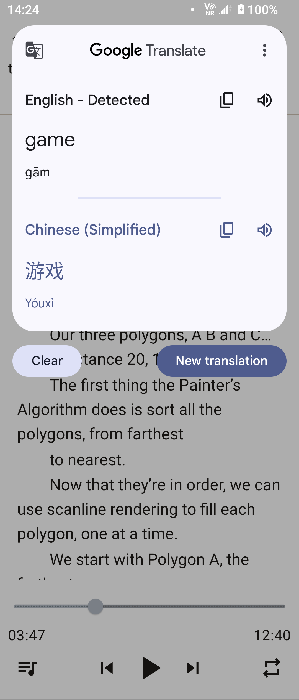
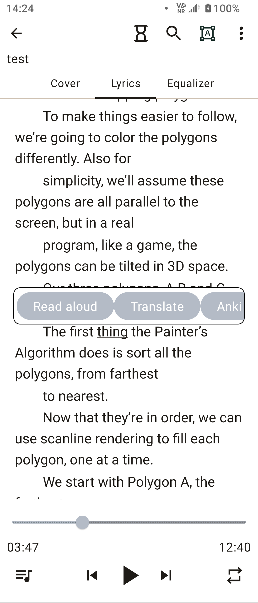

# MonsterMusic

## This is a local music player on Android platform

[Download from Play](https://play.google.com/store/apps/details?id=com.ztftrue.music&pcampaignid=web_share)

[MonsterMusic] is open source, free. Enjoy all the features without any cost!

- 🔊 Advanced Equalizer: Customize your sound experience with our built-in equalizer. Fine-tune the
  audio to match your preferences and immerse yourself in crystal-clear, high-quality sound.
- 🌈 Multiple Themes: Personalize your music player with a variety of themes. Switch effortlessly
  between themes to match your mood or style. Your music, your way!
- 📜 Lyrics Support: Dive deeper into the lyrics of your favorite songs. [MonsterMusic] supports
  lyrics display, you can import text or lyrics files.
  Click the lyrics word, you can find a feature.
- 🔒 Privacy First: Rest easy knowing that your privacy is our top priority. No unnecessary
  permissions, just pure music enjoyment.

More features are waiting for your discovery.

Elevate your music journey with [MonsterMusic] - where innovation meets simplicity. Download now and
embark on a musical adventure like never before!

<video width="320px" controls>
  <source src="./Picture/MonstrMusicExample.mp4" type="video/mp4">
</video>

Songs from: https://helpguide.sony.net/high-res/sample1/v1/en/index.html

It does not support Android 10 and below, but you can compile(need modify code) it to support it,
but some features cannot be used.

## Develop

### Need TODO

- DSP visualize
- Input View color modify
- Add feature PlayList\Queue sort by user
- Add feature Album\Songs sort by Name/Other
- Start Flash
- Composition, Performance optimize

## Note

In project:

The copyright of these pictures (large_cover.jpg,launcher_image.jpg,songs_thumbnail_cover.jpg)
belongs to me and you can use them for free, but need to indicate the source.

Other Icons from: <https://fonts.google.com/icons>.
