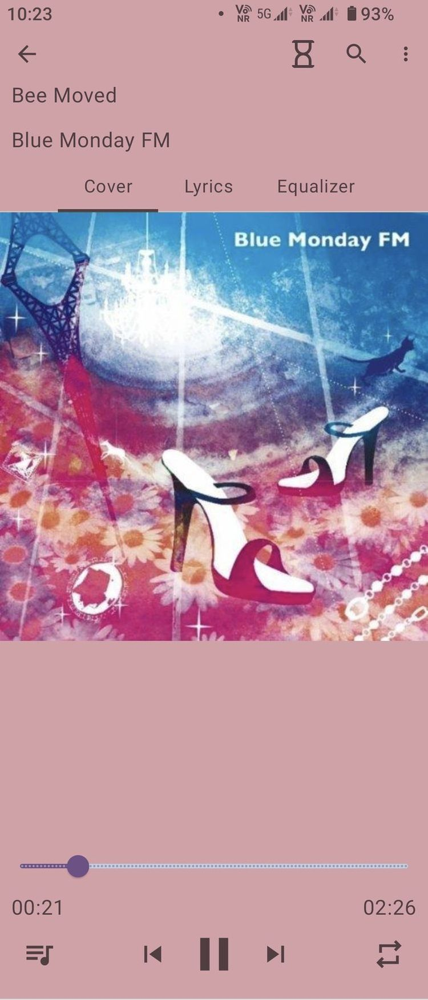
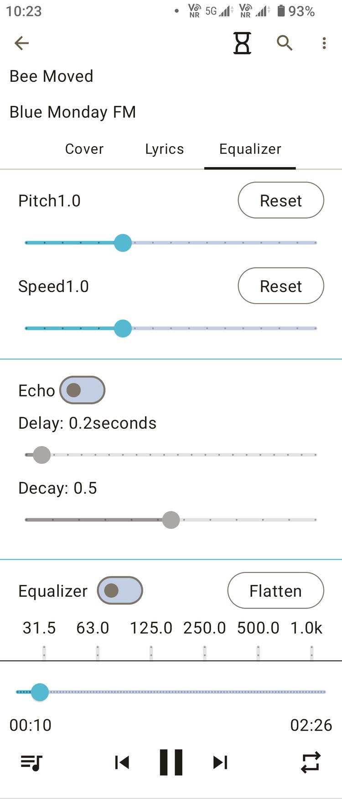
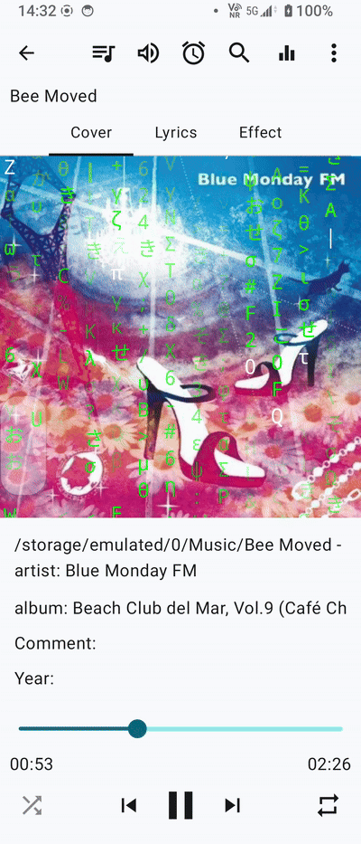
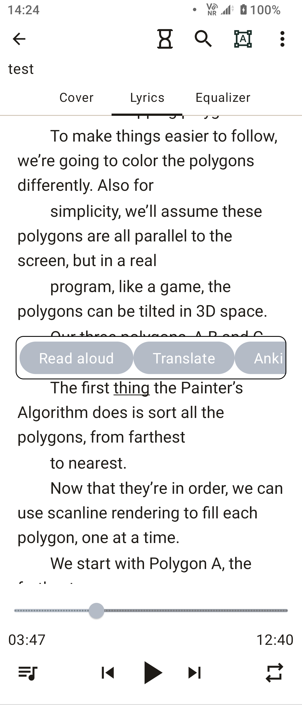
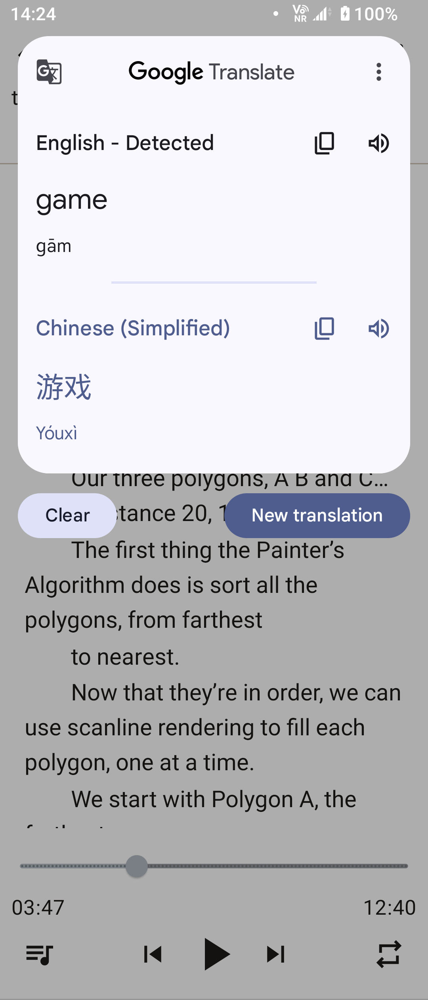
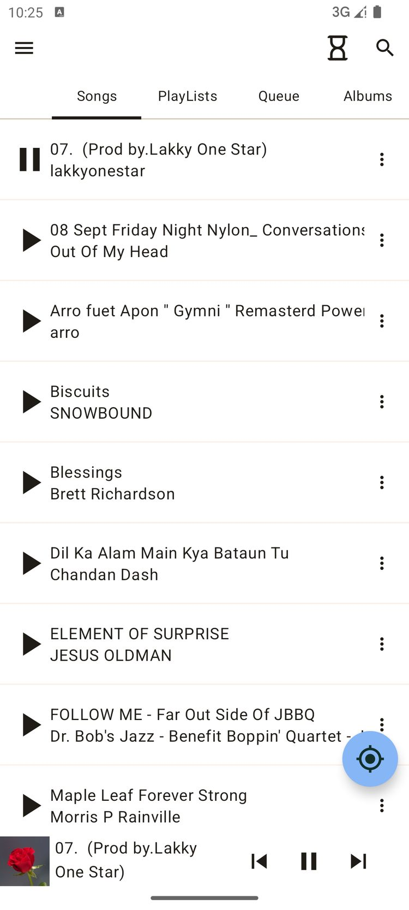
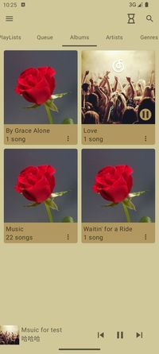
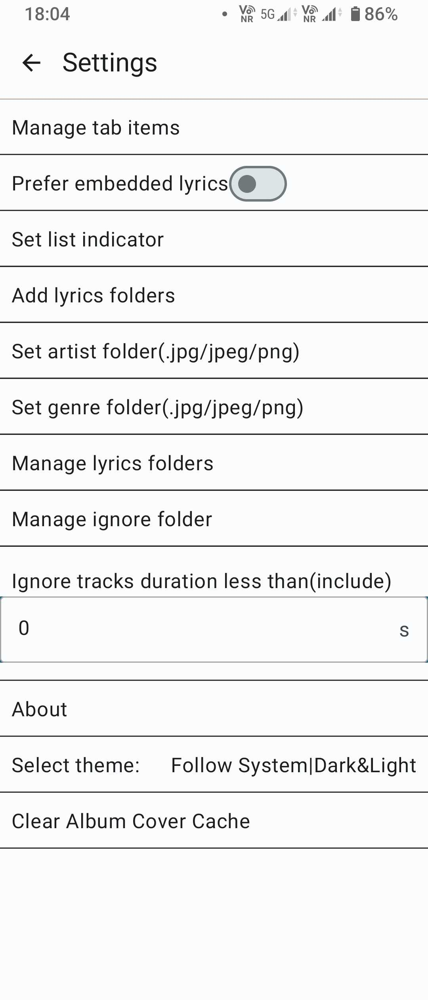

# MonsterMusic

<p align="center">
  
</p>

<p align="center">
  <b>A modern, privacy-first offline music player for Android powered by a high-performance native C DSP audio engine.</b>
</p>

<p align="center">
  <a href="https://f-droid.org/packages/com.ztftrue.music/"></a>
  <a href="https://play.google.com/store/apps/details?id=com.ztftrue.music"></a>
  <a href="https://apt.izzysoft.de/fdroid/index/apk/com.ztftrue.music"></a>
  <a href="https://github.com/ZTFtrue/MonsterMusic/releases/latest"></a>
  <a href="https://github.com/ZTFtrue/MonsterMusic/blob/master/LICENSE"></a>
  <a href="https://discord.gg/R9YbH9TBbJ"></a>
  <a href="https://crowdin.com/project/monstermusic/invite?h=d58c9ddb1dea6fafb617327d66a529b52178797"></a>
</p>

---

## 📥 Download

[](https://f-droid.org/packages/com.ztftrue.music/)
[](https://play.google.com/store/apps/details?id=com.ztftrue.music)
[](https://apt.izzysoft.de/fdroid/index/apk/com.ztftrue.music)

Or download the latest APK directly from the **[Releases Section](https://github.com/ZTFtrue/MonsterMusic/releases/latest)**:
- **`arm64-v8a`** (Recommended for most modern 64-bit Android phones and tablets)
- **`armeabi-v7a`** (For older 32-bit ARM devices)
- **`x86_64`** / **`x86`** (For Android emulators, ChromeOS, and Intel/AMD devices)
- **`universal`** (All architectures bundled in a single APK)

---

## 🌟 Key Features

### 🎛️ Native C DSP Audio Engine
- **Ultra-Low Latency Core**: Audio processing is implemented in native C (`app/src/main/cpp/`) for maximum performance, real-time response, and zero garbage-collection jitter.
- **Dual Filter Architectures**:
  - **Biquad IIR Filters**: High-precision, zero-latency parametric equalizer filters.
  - **FFT FIR Filters**: 2048-point Fast Fourier Transform linear-phase filtering for transparent acoustic response without phase distortion.
- **Master Soft Limiter**: Integrated stereo-linked peak tracking with a smooth tanh curve to eliminate harsh digital clipping.
- **Stereo Spatializer**: Native stereo widening virtualizer that expands your soundstage.

### 🎚️ Studio Audio Effects Suite
- **Stereo Delay**: Configurable delay time, feedback decay, and ping-pong stereo crossfeed.
- **Studio Effects**: Reverb, Chorus, Flanger, and Polyphony effects with optimized DSP algorithms.
- **Independent Dry/Wet Mix**: Every audio effect includes a dedicated `DryWetMixSlider` to fine-tune the exact proportion of processed sound.

### 🔍 Audio Processing Chain Inspector
- **Real-Time Signal Flow View**: Located directly beneath the album cover art, inspect the end-to-end signal path:
  - **Track Info**: Audio format, sample rate, channel count, bit depth, and bitrate.
  - **Decoder**: Active audio codec (MediaCodec / ExoPlayer).
  - **Resampler**: Real-time sample rate conversion status.
  - **DSP Engine**: Filter mode (Biquad IIR vs FFT FIR) and soft-limiter status.
  - **Audio Sink**: Output routing, buffer specifications, and sink sample rate.
- Tap any section to view technical telemetry or jump directly to audio engine settings.

### 🌌 Frequency-Reactive Visualizers
- **Matrix Digital Rain**: Character fall rate, glow intensity, and density dynamically react to real-time audio frequencies.
- **32-Band Audio Spectrum**: Real-time FFT audio spectrum visualizer with logarithmic frequency distribution and smooth peak falloff.
- **Fullscreen & Landscape Mode**: Switch to a dedicated fullscreen visualization view with landscape lock and screen keep-awake toggle.
- **Cover Bounded Mode**: In standard portrait view, visualizers are cleanly contained within the album artwork boundaries.

### ⏩ Pitch & Playback Speed Controls
- **Dual Coarse & Fine Sliders**: Coarse steps (0.1x) and ultra-fine adjustments (0.01x) for playback speed (0.25x – 3.0x).
- **Pitch Shifting**: Independent pitch adjustment with high-fidelity time stretching.

### 📜 Interactive Synchronized Lyrics
- **Smooth Auto-Scroll**: Active lyric lines automatically smoothly center in the view.
- **Drag-to-Seek Navigation**: Seek directly to any point in the song by dragging along lyric timestamps.
- **Word-Level Dictionary Popup**: Tap any word in the lyrics to open a dictionary lookup popup with support for multiple dictionary providers and auto-dismiss settings.
- **Universal Formats**: Supports embedded lyrics (ID3/Vorbis/MP4) as well as external `.lrc`, `.vtt`, `.srt`, and `.txt` files.

### 🎨 Material Design 3 & Theming
- Fully compatible with Material Design 3 and Android 12+ dynamic colors (Monet).
- Multiple customizable themes and accents to match your personal aesthetic.

### 🔒 100% Offline & Privacy First
- Operates completely without network access.
- No ads, no telemetry, no tracking, and no unnecessary permissions.

---

## 📱 Screenshots

<div align="center">
  
  
  
  
</div>
<div align="center">
  
  
  
  
</div>

---

## 🛠️ Architecture & Tech Stack

- **UI Framework**: [Jetpack Compose](https://developer.android.com/jetpack/compose) with Material Design 3
- **Audio Engine**: [AndroidX Media3 (ExoPlayer)](https://developer.android.com/guide/topics/media/media3) + Native C DSP via JNI
- **Native Build System**: CMake `3.22.1` + Android NDK `r27c` (`27.3.13750724`)
- **Database**: [Room](https://developer.android.com/training/data-storage/room) with Kotlin Symbol Processing (KSP)
- **Concurrency**: Kotlin Coroutines & StateFlow
- **Image Loading**: [Coil 3](https://coil-kt.github.io/coil/)

---

## 🏗️ Building from Source

### Prerequisites
- Android Studio Ladybug (or newer)
- JDK 17
- Android SDK Platform 37
- Android NDK `27.3.13750724` (`r27c`)
- CMake `3.22.1`

### Clone and Compile
```bash
# Clone the repository
git clone https://github.com/ZTFtrue/MonsterMusic.git
cd MonsterMusic

# Build Debug APK
./gradlew assembleDebug

# Build Release APK
./gradlew assembleRelease
```
The compiled APK will be located in `app/build/outputs/apk/`.

---

## 🌐 Community & Translations

- **Discord**: Join our community on [Discord](https://discord.gg/R9YbH9TBbJ) to discuss features, report issues, and chat.
- **Crowdin**: Help translate MonsterMusic into your language on [Crowdin](https://crowdin.com/project/monstermusic/invite?h=d58c9ddb1dea6fafb617327d66a529b52178797).
- **Support the Project**: Read [I need your help](./I_need_your_help.md).

---

## 📄 License

MonsterMusic is licensed under the [Apache License 2.0](LICENSE).
